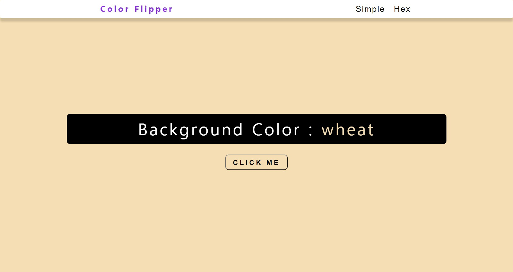
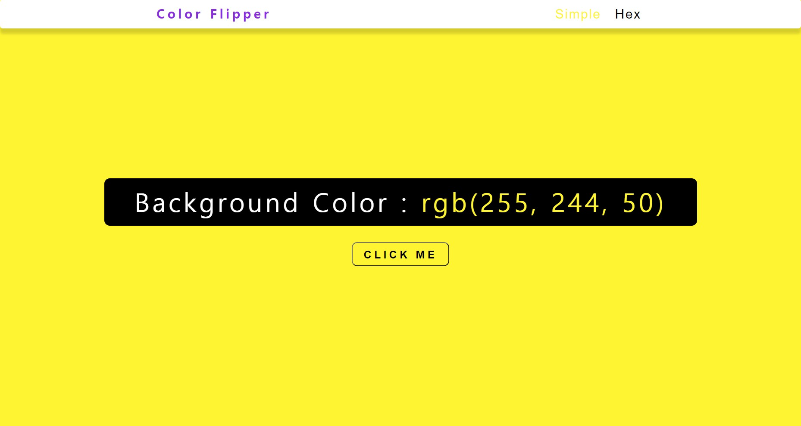
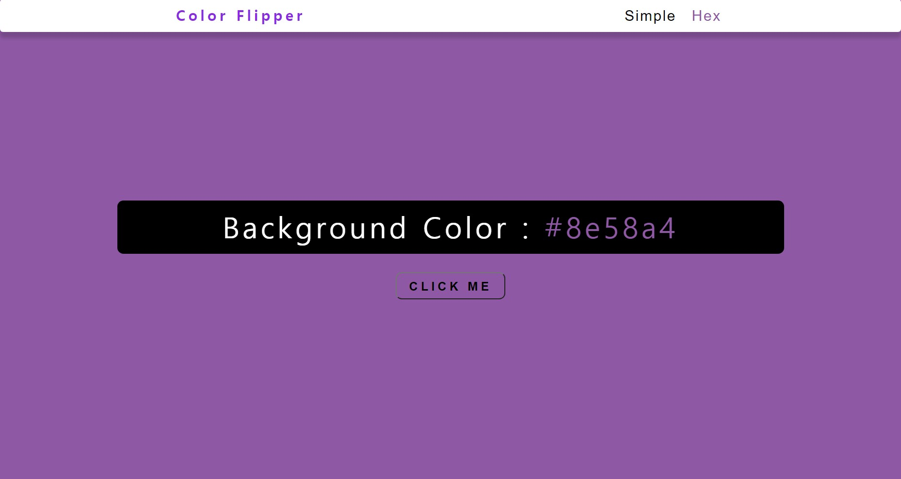

# Color-Flipper
 
<ol>
  <li><strong>프로젝트 이름</strong> : Color Flipper</li>
  <li><strong>사용 언어</strong> : HTML, CSS, vanila Javascript</li>
  <li><strong>주요 기능</strong> 
    <ul>
      <li><h5>Simple</h5>화면 우측 상단 Simple 버튼을 누르면 사전에 추출된 7개의 색 중 하나로 배경색을 지정합니다.</li>
      <li><h5>Hex</h5>화면 우측상단 Hex 버튼을 누르면, 랜덤한 hex number가 추출되며 배경색으로 지정됩니다.</li>
      <li><h5>Click Me!</h5> Simple 또는 Hex 버튼을 누른 후 화면 중앙 Click Me! 버튼을 누르면 현재 선택된 설정에따라 랜덤으로 배경색이 지정됩니다.</li> 
    </ul>
   </li> 

   
  
  <h5> 초기화면 </h5>
  
  <h5> Simple 버튼 클릭 </h5>
  
  <h5> Hex 버튼 클릭 </h5>
  
  

  
   
  <li><strong> 배운 점</strong>
  <ol><li> += 를 이용해 문자열을 쉽게 합칠 수 있음.</li>
  <li>let simpleClicked = true처럼 미리 boolean으로 상태 값을 지정해놓는다면, 경우 및 조건에 따라 기능을 확장시키기 용이하다.</ol>
   
  

  
  
</li> 
  
  <ol>
